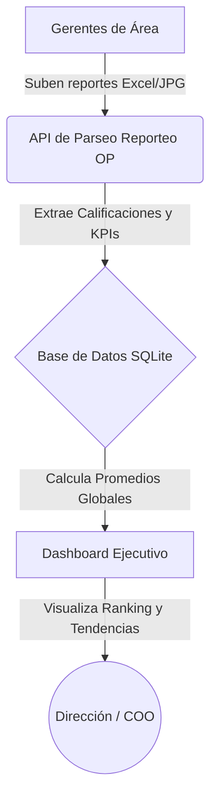

# Ecosistema Optimal: DashOP & Reporteo OP
**Manual Arquitectónico y Funcional**

Este documento describe la arquitectura, flujo de trabajo y stack tecnológico del ecosistema de software de Optimal, diseñado para abarcar desde la operación administrativa y fiscal (DashOP) hasta la inteligencia de negocios y el cumplimiento de KPIs directivos (Reporteo OP).

---

## 1. Visión Directiva (¿Cómo funciona el negocio aquí?)

El ecosistema está dividido en dos grandes "hemisferios" que operan de forma independiente pero complementaria:

1. **DashOP (Operaciones y Facturación):** Es el motor de "trinchera". Aquí se conectan los sistemas contables (Contpaq), correos electrónicos (Gmail) y archivos XML del SAT. Su objetivo principal es asegurar la **Materialidad Fiscal**, detectar facturas canceladas automáticamente y mantener un padrón de empresas limpio.
2. **Reporteo OP (Tablero Ejecutivo y Cumplimiento):** Es el motor "analítico". Las gerencias (Contabilidad, RH, Legal, Tesorería, Operaciones, Administración) suben mes a mes sus formatos de evaluación (KPIs). El sistema ingiere estos datos, los califica y alimenta un **Dashboard Ejecutivo** para que la Dirección (COO/CEO) vea de un vistazo la salud global de la empresa.

### El Flujo de Información Ejecutivo

---

## 2. Arquitectura Técnica y Stack

El sistema está construido buscando ligereza, velocidad de despliegue y nula dependencia de servidores costosos, utilizando bases de datos locales (SQLite) y túneles seguros para acceso remoto.

### 2.1 Stack Tecnológico

| Capa | Reporteo OP (Dashboard/KPIs) | DashOP (ERP/Fiscal) | Propósito |
| :--- | :--- | :--- | :--- |
| **Frontend (UI)** | HTML5, CSS3, Vanilla JavaScript, Chart.js | HTML5, CSS3, Vanilla JS | Ligeros, sin frameworks pesados, carga instantánea. |
| **Backend (API)** | Python (FastAPI), Uvicorn | Python (FastAPI), Uvicorn | APIs REST ultrarrápidas y asíncronas. |
| **Base de Datos** | SQLite (`complianceop.db`) | SQLite (`portal_erp.db`) | Almacenamiento transaccional embebido. |
| **ORM / Datos** | SQLAlchemy, Pandas, OpenPyXL | Pandas, xml.etree | Manejo de modelos, lectura de Excels y parseo de XMLs. |
| **Autenticación** | JWT (JSON Web Tokens), bcrypt | Autenticación básica | Seguridad sin estado para sesiones. |
| **Infraestructura** | Cloudflare Tunnels (cloudflared) | Cloudflare Tunnels | Exposición segura a internet sin abrir puertos del router. |

---

## 3. Módulo A: DashOP (Operaciones Fiscales)

Ubicado en la carpeta raíz `app/`. Este módulo automatiza la revisión fiscal.

### Procesos Clave
- **Sincronización de Emisoras (`sincronizar_emisoras.py`):** Mantiene actualizado el catálogo de empresas contra un Excel maestro.
- **Detección de Canceladas (`detectar_canceladascontpaq.py`):** Revisa masivamente directorios de facturas XML y detecta cuáles han sido canceladas en el sistema contable, cruzando información con archivos maestros para evitar discrepancias.
- **Auditoría de Gmail (`buscar_gmail.py`):** Automatización para extraer comprobantes y notificaciones directo desde bandejas de correo.

---

## 4. Módulo B: Reporteo OP (Inteligencia Directiva)

Ubicado en la carpeta `compliance/`. Es el portal de inteligencia de negocios.

### 4.1 Motor de Parseo de KPIs
El corazón del módulo. Cuando un gerente sube su evaluación mensual en Excel:
1. El backend (`api/kpis.py`) recibe el archivo `.xlsx`.
2. Utiliza `OpenPyXL` para leer celdas específicas basadas en palabras clave (ej. "calificación", "global", "total").
3. Registra el `global_score` y desgrana línea por línea (sub-evaluaciones) en la base de datos (`kpi_evaluations` y `kpi_evaluation_details`).
4. *Limitación conocida:* Si un área (ej. Administración) sube imágenes (`.jpg`) en lugar de Excel, el motor no puede leerlas y asignará un score de `0%` por defecto.

### 4.2 Dashboard Ejecutivo (`compliance_app.js`)
Diseñado para la toma de decisiones rápidas (Visión COO).
- **Score Global:** Promedio dinámico de todos los departamentos reportados en el mes activo vs mes anterior.
- **Ranking de Desempeño:** Gráfica de barras horizontales (Chart.js) que ordena a los gerentes de mayor a menor cumplimiento.
- **Evolución Histórica:** Gráfica de líneas que compara la trayectoria de cada departamento contra el **Promedio Global** de la empresa (Línea de flotación).

### 4.3 Control de Accesos (RBAC)
- **Rol `admin`**: Acceso total, puede ver el Dashboard Ejecutivo y forzar revisiones.
- **Rol `manager` / `user`**: Acceso aislado (Silo de datos). El gerente de Contabilidad solo puede ver y subir métricas de Contabilidad.

---

## 5. Infraestructura y Operaciones IT

El ecosistema corre de manera local (On-Premise) en la computadora/servidor principal, orquestado mediante scripts Batch (`.bat`) para facilitar su uso a operadores no técnicos.

### 5.1 Scripts de Inicialización
- `INICIAR_ERP.bat` / `INICIAR_TUNEL.bat`: Levantan los servidores Uvicorn de Python y abren la conexión a Cloudflare para dar salida a internet con URLs públicas HTTPS.
- `CERRAR_TODO.bat`: Mata los procesos de Python de forma segura para reiniciar el sistema.
- `AUTO_INICIO_ERP.bat`: Configurado en el Task Scheduler de Windows para asegurar que el sistema se levante si la PC se reinicia.

### 5.2 Política de Respaldos
- Se prioriza un esquema de compresión ZIP.
- El servidor acumula Gigabytes de datos principalmente por el histórico de la carpeta `XML_Respaldos`.
- Los scripts como `scripts/check_backups.py` auditan que las carpetas de respaldo estén recibiendo datos.
- **Respaldo Limpio:** Regularmente se comprime únicamente el código fuente, y los archivos `.db` (`complianceop.db`, `portal_erp.db`) omitiendo dependencias (`venv`, `node_modules`) para conservar almacenamiento.

---
*Documento generado automáticamente por el Arquitecto del Sistema.*
